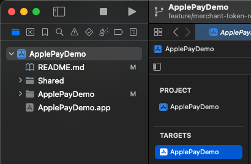
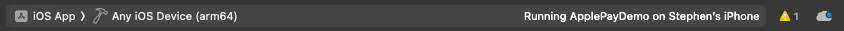

# 🍎 Apple Pay demo app

## Overview

This project implements various Apple Pay transaction flows on iOS.

Included are demonstrations of how to:
- Use the Apple Pay button
- Display the Apple Pay payment sheet
- Make payment requests (one-off, recurring, funds transfer a.k.a. payout)
- Accept coupon codes
- Filter and validate user input (card network, type, billing/shipping data)
- Handle external API calls ([Checkout.com](https://www.checkout.com/) tokenization, payout eligibility, balance check)

The ticket booking app includes options for buying and selling tickets, as well as signing up for a subscription service using Apple Pay.

A Checkout.com token (`tok_...`) will be produced from Apple Pay token data output. Both are printed to console, alongside the results of various checks during each transaction flow.

Payment processing/status handling is not in the scope of this project. There are `TODO` comments in the code where you can implement this if required.

## 🏃 Get started

You will need:
- A Mac
- [Xcode](https://apps.apple.com/us/app/xcode/id497799835?mt=12/)
- Access to an [Apple Developer account](https://developer.apple.com/programs/enroll/)
- **[Optional]** an iPhone or iPad

### Configure the project

1. Sign in [here](https://developer.apple.com/account/resources/identifiers/list/bundleId) and create an App ID. Enable the `Apple Pay Payment Processing` capability and make a note of your `Bundle ID`.

2. Complete steps 1-4 [here](https://www.checkout.com/docs/payments/add-payment-methods/apple-pay#Set_up_Apple_Pay) to create a Merchant ID and register a Payment Processing Certificate with Checkout.com.

3. Open `ApplePayDemo.xcodeproj` in Xcode.

4. Click on the top-level `ApplePayDemo` directory, then under **TARGETS** click on `ApplePayDemo`.

    

5. Under the **General** tab, change the `Bundle Identifier` to your Bundle ID from step 1.

6. Go to the **Build Settings** tab and search for `com.checkout.applepaydemo`; replace any instances with your Bundle ID.

7. Go to the **Signing & Capabilities** tab and add (+) the `Apple Pay` capability. Ensure you have `Automatically manage signing` enabled and your **Team** and **Bundle Identifier** match what's in your developer account. Under **Apple Pay** you should now be able to select your Merchant ID.

> [!TIP]
> Click refresh if Merchant IDs are not appearing.

8. Open [/Shared/Configuration.swift](./Shared/Configuration.swift) and update the following values:
- **Merchant** `identifier` = your Apple Merchant ID
- **CheckoutDotCom** `publicKey` = your Checkout.com public API key (`pk_...`)

### [Optional] AWS configuration

> [!IMPORTANT]
> At this point you can run the app just fine ✅ [Skip to **build and run**](#build-and-run) Only continue if you want to test with server-side API calls for card payout eligibility and balance checks.

> [!CAUTION]
> This guide is intended for demo purposes only. You should use [AWS Secrets Manager](https://us-east-1.console.aws.amazon.com/secretsmanager) to secure API secrets for any real deployment.

1. [Create a new Lambda function](https://console.aws.amazon.com/lambda/home#/functions) with default settings.

2. Once created, go to your new function and scroll down. Under the **Code** tab you should see an `Upload from ▼` option. Open the dropdown and select `.zip file`. Upload this file: [getCardMetadata-lambda.zip](./resources/lambda-functions/getCardMetadata-lambda.zip).

3. Go to the **Configuration** tab then select `Environment variables` and enter the following:
   - `CKO_API_KEY` = your Checkout.com secret API key (`sk_...`)
   - `CKO_ENV` = the target Checkout.com environment (e.g. `api.sandbox.checkout.com`)

4. [Create a new REST API](https://us-east-1.console.aws.amazon.com/apigateway/main/create-rest).

5. Once created, select `Create method` and add a **POST** method to your Lambda function.

7. Select `Deploy API` and create a new stage (e.g. `dev`). Make a note of the resulting **Invoke URL**.

8. Create another Lambda function, this time uploading: [getCurrencyAccountBalances-lambda.zip](./resources/lambda-functions/getCurrencyAccountBalances-lambda.zip).

9. Go to the **Configuration** tab then select `Environment variables` and enter the following:
   - `CKO_API_KEY` = your Checkout.com secret API key (`sk_...`)
   - `CKO_ENV` = the target Checkout.com environment (e.g. `balances.sandbox.checkout.com`)
   - `CKO_ENTITY_ID` = the ID of the Checkout.com entity you want to check balances under (`ent_...`)

10. [Create a new REST API](https://us-east-1.console.aws.amazon.com/apigateway/main/create-rest).

11. Once created, select `Create method` and add a **GET** method to your Lambda function.

12. Select `Deploy API` and create a new stage (e.g. `dev`). Make a note of the resulting **Invoke URL**.

13. In [/Shared/Configuration.swift](./Shared/Configuration.swift) update the following values:
- **CheckoutDotCom** `currencyAccountId` = the ID for the Checkout.com currency account you want to perform balance checks on (`ca_...`)
- **Server**
  - `metadataApiUrl` = invoke URL from step 7
  - `balancesApiUrl` = invoke URL from step 12

### Build and run

In the title bar of Xcode, you should see the build scheme **iOS App**. Click the option to the right of this which reads **Any iOS Device** in my example below, and a dropdown should appear.

You have 2 options to run the app:

>#### 💻 Simulator
>From the dropdown, select the desired device simulator under **iOS Simulators**.

**OR**

>#### 📱 Device
>1. On your iOS device, open `Settings` > `Privacy & Security` and scroll down to the `Developer Mode` list item. Tap into this and toggle **Developer Mode** on.
>2. If your device is connected to the same Wi-Fi network as your Mac, then it should appear automatically to select under **iOS Device**.  Alternatively, you can connect the device to your Mac via USB for the same result.

 
Finally, click the run button (►) on the left of the title bar to start the app.

## 📁 Project structure

### **/Shared**

Generic files which can be used across any app.

>#### [`Configuration.swift`](./Shared/Configuration.swift)
>Contains constants for:
>- Apple Merchant ID
>- Checkout.com public API key (for tokenization)
>- API endpoints for backend processing

>#### [`PaymentPaymentHandler.swift`](./Shared/PaymentHandler.swift) [`PayoutPaymentHandler.swift`](./Shared/PayoutHandler.swift) [`RecurringPaymentHandler.swift`](./Shared/RecurringPaymentHandler.swift)
>Classes handling logic for different transaction types within an app.

### **/ApplePayDemo**

Files specific to the demo app.

>#### [`ApplePayDemo.entitlements`](./ApplePayDemo/ApplePayDemo.entitlements)
>A list of merchant IDs used for Apple Pay - replace with your own.

>#### [`AppDelegate.swift`](./ApplePayDemo/AppDelegate.swift) [`SceneDelegate.swift`](./ApplePayDemo/SceneDelegate.swift)
>Boilerplate files for managing app lifecycle.

>#### [`BuyViewController.swift`](./ApplePayDemo/BuyViewController.swift) [`SellViewController.swift`](./ApplePayDemo/SellViewController.swift) [`SubscribeViewController.swift`](./ApplePayDemo/SubscribeViewController.swift)
>Manage UI state for each tab view.

>#### [`Main.storyboard`](./ApplePayDemo/Main.storyboard)
>Design of the app UI, including scenes representing each screen.

>#### [`Assets.xcassets`](./ApplePayDemo/Assets.xcassets/)
>Collection of icons used in the app.

>#### [`LaunchScreen.storyboard`](./ApplePayDemo/Base.lproj/LaunchScreen.storyboard)
>Controls the screen the app launches into.

>#### [`Info.plist`](./ApplePayDemo/Info.plist)
>Configuration details for the app bundle; the file references values from the app's Build Settings.

